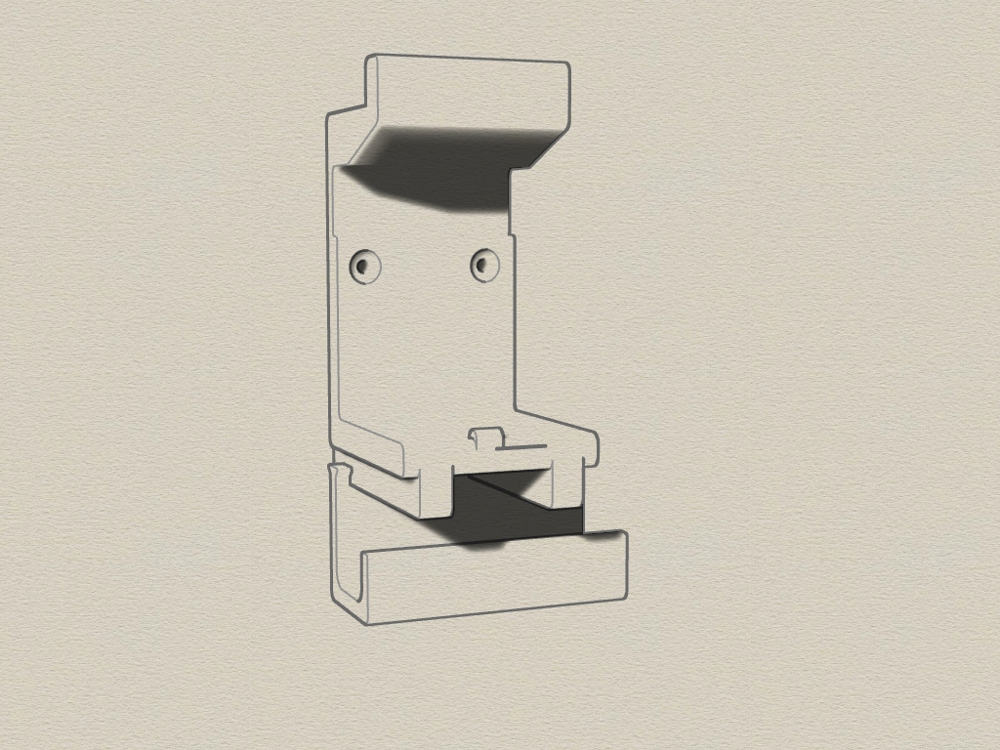
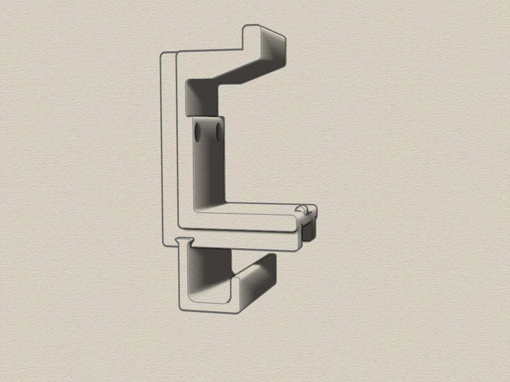
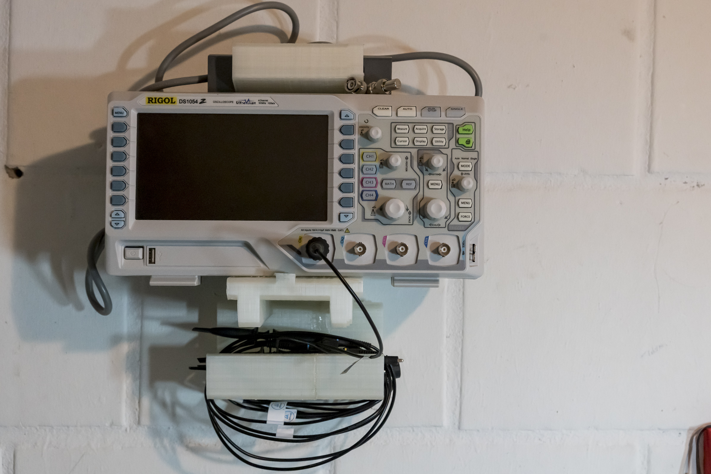
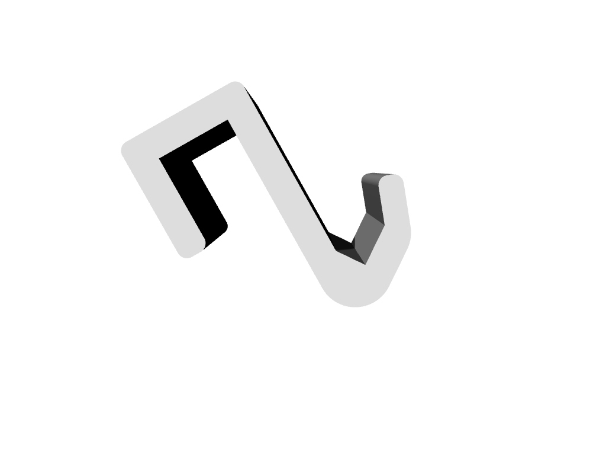
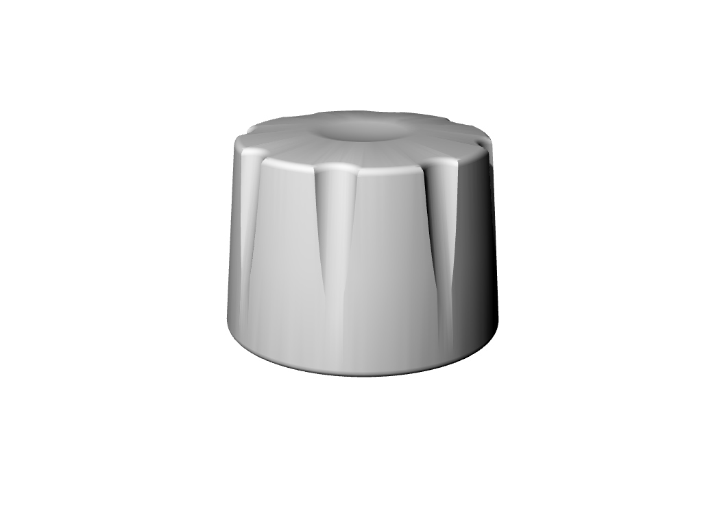

# Rigol-1054Z-Wallmount
3D printable Wallmount for Rigol 1054Z Oscilloscope. With shelf for test probes. Created with Rhino 6.

Requirements:
* 3D printer 
* Filament of your choice

## View

# Added ladder-mount for Rigol 1054Z

# Added BNC-connector-protective-cover

